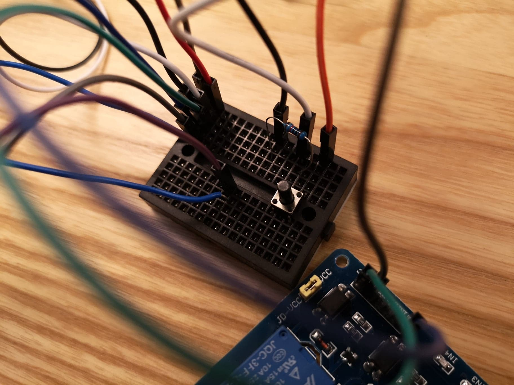
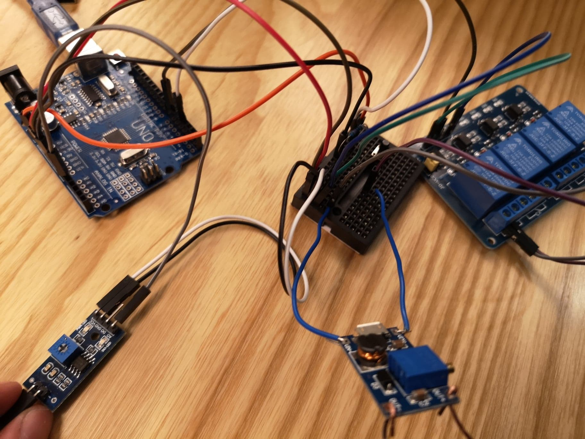
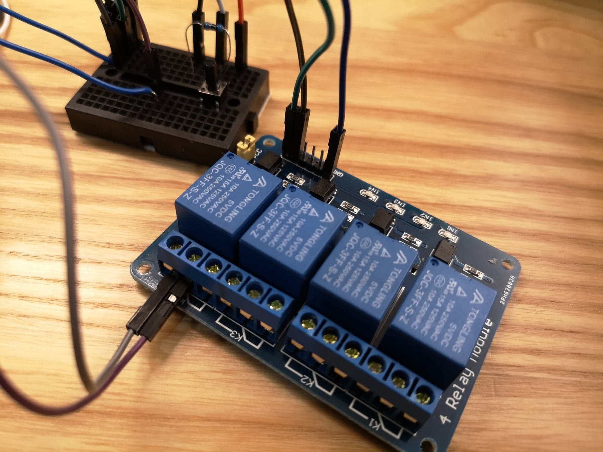
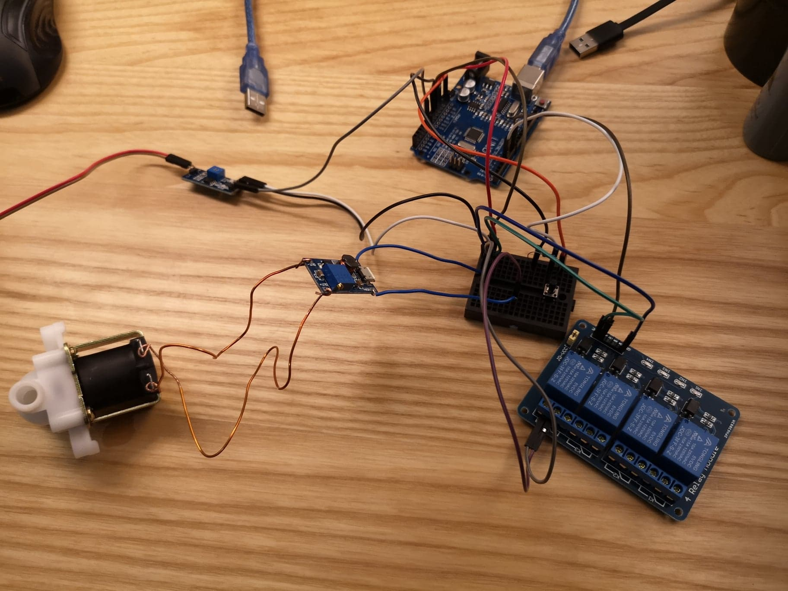
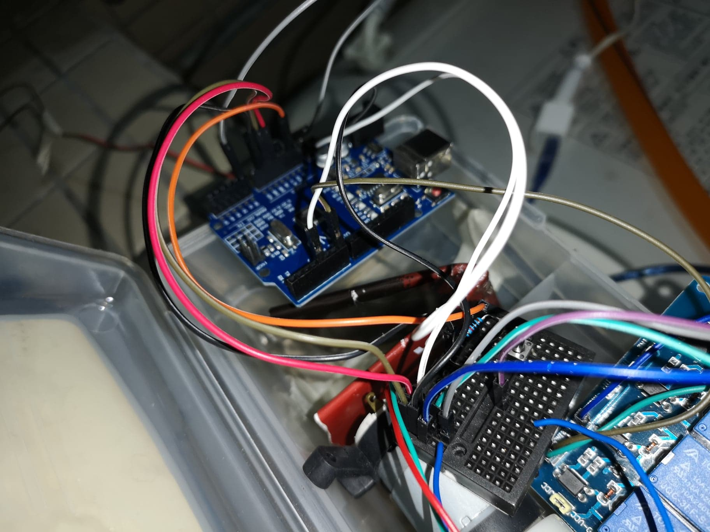
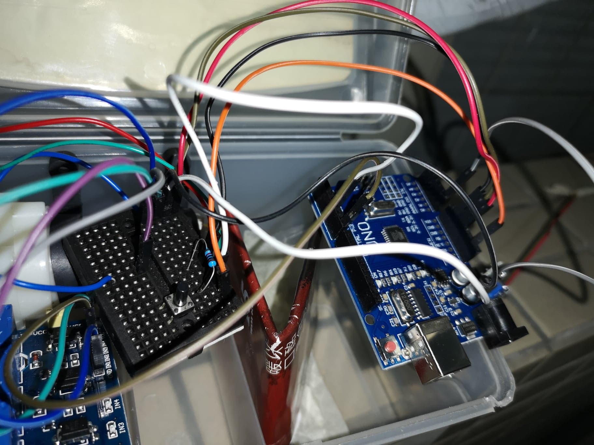
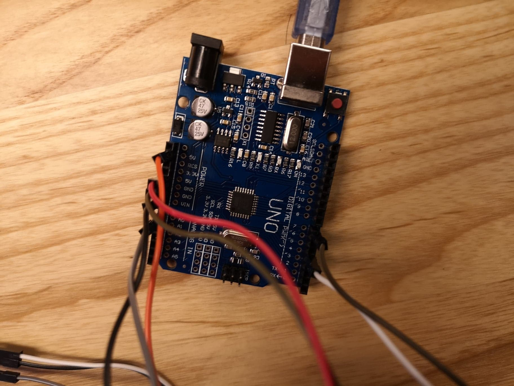
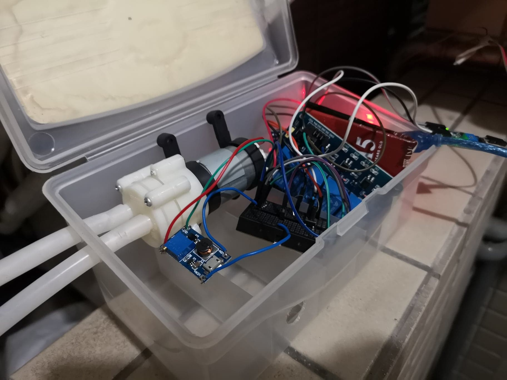
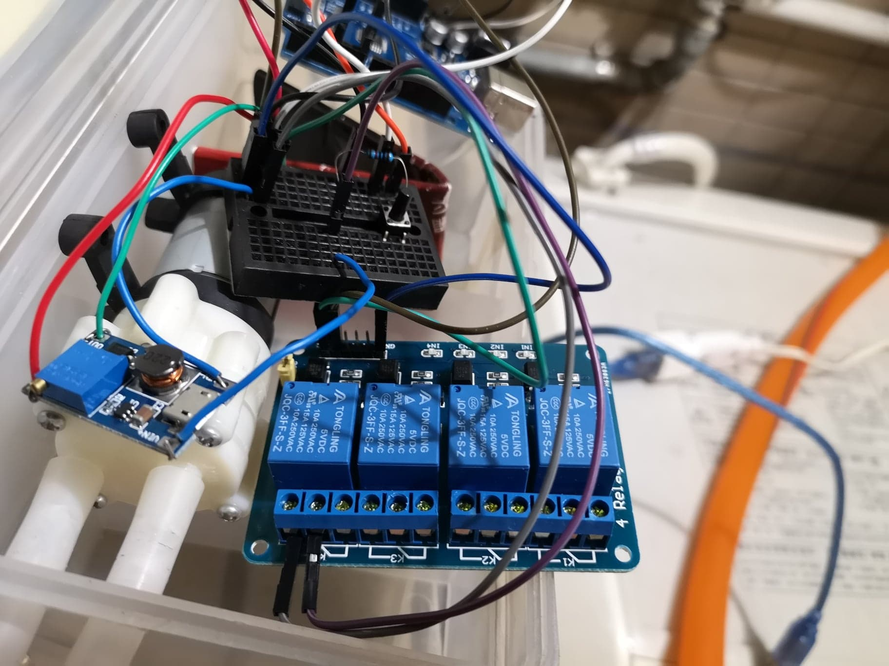

## Arduino 自動澆花系統

### Motivation
My plants keep dying

### Attempt 1
用電磁閥接家裡水龍頭,控制水龍頭的水流,一勞永逸
-> 失敗
原因：買到的電磁閥能承受的水壓不足，擋不住水龍頭的水壓,而能承受的都太大或是太貴。

### Attempt 2
用水磊,從水缸中抽水,簡單,缺點是每幾個禮拜就要加水缸的水。

### Reference
https://github.com/haidongZhang/automaticWatering/blob/master/automaticWatering.ino

### Pictures

